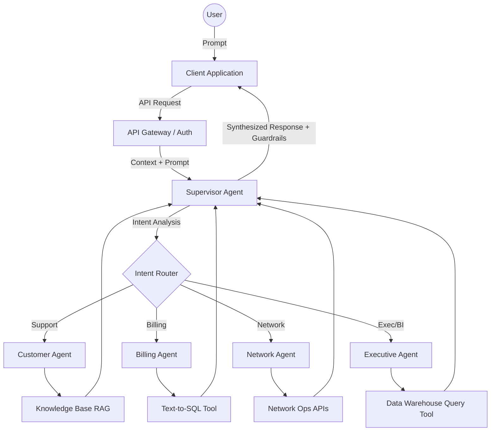
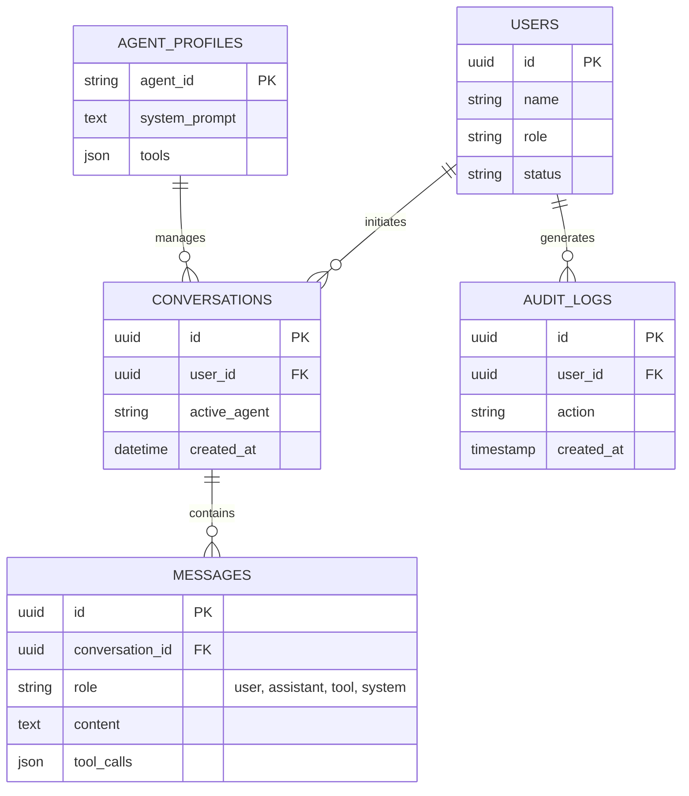

# Telecom AI Command Center (TAICC)
## Enterprise Software Architecture Document

---

## 1. Product Vision
To build a unified, intelligent, and autonomous AI operating platform for telecom enterprises. TAICC transitions telecom operations from reactive, siloed processes to proactive, automated, and hyper-personalized experiences. It empowers everyone from customers to C-level executives by orchestrating a suite of specialized AI agents that seamlessly handle customer service, network diagnostics, billing anomalies, fraud prevention, and strategic decision-making.

## 2. Business Problems
*   **High Operational Expenditure (OpEx):** Massive support teams are required to handle repetitive tier-1 queries and billing disputes.
*   **Network Downtime & High MTTR:** Identifying the root cause of network faults is highly manual and requires correlating logs across fragmented systems.
*   **Customer Churn:** Poor customer service experiences and lack of personalized retention strategies lead to high subscriber churn.
*   **Revenue Leakage & Fraud:** Reactive fraud detection allows bad actors to exploit networks before being blocked.
*   **Delayed Executive Insights:** Leadership relies on static, retrospective reports rather than real-time, predictive intelligence.

## 3. Existing Pain Points
*   **Siloed Data:** CRM, Billing, Network, and Support data reside in isolated databases, making cross-domain insights nearly impossible.
*   **Dumb Chatbots:** Existing rule-based chatbots fail on complex queries, frustrating users and leading to high human handoff rates.
*   **Tool Fatigue:** Employees use dozens of disparate dashboards to diagnose a single issue.
*   **Security & Compliance Risks:** Handling sensitive telecom data (PII, CDRs) requires strict governance that off-the-shelf LLMs cannot guarantee.

## 4. Proposed AI Solution
TAICC is an Enterprise AI Operating Platform built on a **Multi-Agent Large Language Model Architecture**. Instead of a single monolithic chatbot, TAICC utilizes a **Supervisor Agent** that interprets user intent and dynamically routes queries to specialized, domain-expert agents (Billing, Network, Fraud, etc.). Each agent is armed with specific RAG (Retrieval-Augmented Generation) pipelines, specialized memory, and secure API tool access to read data and execute actions autonomously with "human-in-the-loop" safeguards.

## 5. User Personas

*   **Customer:** Interacts with the platform via consumer-facing interfaces for self-service troubleshooting, plan upgrades, and billing inquiries.
*   **Support Agent:** Uses the AI Copilot to instantly summarize call histories, analyze customer sentiment, and receive recommended resolutions.
*   **Network Engineer:** Relies on the platform to automatically detect anomalies, visualize network topology, and suggest automated remediation scripts for outages.
*   **Manager:** Monitors workforce efficiency, AI deflection rates, and escalations in real-time.
*   **Admin:** Configures AI guardrails, manages data access policies (RBAC), and monitors system health.
*   **Executive:** Uses natural language queries to instantly generate BI dashboards (e.g., "Show me churn risk by region for the past 30 days").

## 6. Functional Requirements
*   **Multi-Agent Orchestration:** System must route intents to specialized agents seamlessly.
*   **Natural Language Data Interrogation:** Users must be able to query SQL/NoSQL databases using natural language (Text-to-SQL).
*   **Automated Diagnostics:** System must ingest network logs and provide root-cause analysis (RCA) summaries.
*   **Real-time Alerting:** Push notifications and automated mitigation for detected fraud or network anomalies.
*   **Personalized Offers:** Generate dynamic retention offers based on user usage patterns and sentiment.

## 7. Non-Functional Requirements
*   **High Availability:** 99.99% uptime for core agent routing.
*   **Latency:** < 2 seconds Time to First Token (TTFT) for AI responses.
*   **Scalability:** Support up to 10,000 concurrent internal and external sessions.
*   **Security & Privacy:** PII redaction before LLM inference; SOC2 and GDPR compliance.
*   **Observability:** Comprehensive tracing of LLM prompts, tool executions, and system latency.

## 8. Complete Feature List
1.  **AI Unified Inbox:** Omnichannel support aggregation with automated drafting and sentiment analysis.
2.  **Network Topology AI Visualizer:** Real-time map of network health with AI overlay for outage predictions.
3.  **Automated Billing Reconciliation:** AI agents cross-checking usage logs with billing systems to find discrepancies.
4.  **Predictive Churn Engine:** Real-time flagging of high-risk customers with one-click AI-generated retention campaigns.
5.  **Executive Natural Language BI:** Dynamic dashboard generation via chat prompts.
6.  **Autonomous Script Execution:** Network engineers can approve AI-generated Bash/Python scripts to fix server issues.
7.  **Smart RAG Knowledge Base:** Real-time ingestion of SOPs (Standard Operating Procedures) for Support Agents.

## 9. Product Roadmap
*   **Phase 1 (M1-M2): Core Infrastructure & Support**
    *   Setup API Gateways, Vector DBs, and LLM orchestration.
    *   Deploy Supervisor Agent and Customer/Support Agents.
*   **Phase 2 (M3-M4): Operations & Billing Integration**
    *   Deploy Network Agent (Log ingestion, RCA).
    *   Deploy Billing Agent (Text-to-SQL for financial data).
*   **Phase 3 (M5-M6): Intelligence & Security**
    *   Deploy Fraud and Retention Agents.
    *   Implement Predictive AI models and continuous learning loops.
*   **Phase 4 (M7+): Executive Vision & Autonomy**
    *   Deploy Executive Agent for BI generation.
    *   Enable full autonomous healing for low-risk network anomalies.

## 10. AI Capabilities
*   **Semantic Intent Routing:** Deep learning classifiers to route complex multi-intent queries.
*   **Agentic Tool Use (Function Calling):** LLMs executing REST APIs to interact with legacy telecom systems.
*   **Text-to-SQL & Text-to-Graph:** Querying operational databases and graph databases (network topologies) via natural language.
*   **Multi-modal Analysis:** Ingesting images of broken routers or screenshots of error codes from field technicians.
*   **Dynamic Guardrails:** AI firewalls to prevent prompt injection and ensure deterministic outputs for critical operations.

## 11. Multi-Agent Architecture

*   **Supervisor Agent:** The orchestration layer. Evaluates the prompt, extracts intent, and delegates tasks to child agents. Aggregates responses if a query spans multiple domains.
*   **Customer Agent:** Specialized in high-empathy, brand-aligned communication. Handles FAQs, plan details, and basic troubleshooting via RAG.
*   **Billing Agent:** Equipped with Text-to-SQL capabilities. Analyzes CDRs (Call Detail Records) and billing databases to explain charges or issue refunds securely.
*   **Network Agent:** Connected to observability tools (Prometheus, Splunk). Analyzes stack traces, correlates alerts, and proposes infrastructure fixes.
*   **Fraud Agent:** Monitors transaction streams. Uses specialized anomaly detection models combined with LLM reasoning to flag SIM swapping or toll fraud.
*   **Retention Agent:** Analyzes sentiment and usage data to craft hyper-personalized promotional offers to save churning customers.
*   **Executive Agent:** A BI-specialized agent that can generate charts, query data warehouses, and summarize operational health into actionable insights.

## 12. AI Flow Diagram



## 13. RAG Architecture
*   **Ingestion Pipeline:** Cron jobs and webhooks pull PDFs (SOPs), Confluence pages, and historical tickets.
*   **Chunking & Processing:** Semantic chunking strategy preserving document hierarchy.
*   **Embedding Model:** `text-embedding-3-large` (or open-source equivalent like `bge-large-en-v1.5` for privacy).
*   **Vector Database:** **Milvus** or **Qdrant** for high-throughput similarity search.
*   **Retrieval Strategy:** Hybrid Search (Dense Vector Semantic Search + Sparse BM25 Keyword Search) followed by a Re-ranking step (e.g., Cohere Re-rank) to ensure utmost accuracy before context injection.

## 14. Memory Architecture
*   **Short-Term (Session) Memory:** Stored in **Redis**. Maintains the context window for the active conversation (usually the last 10-20 turns).
*   **Long-Term (Semantic) Memory:** Summarized session intents and user preferences embedded and stored in the Vector DB, allowing the AI to "remember" past interactions across sessions.
*   **Entity Graph Memory:** Crucial for telecom. Tracking entities (e.g., User A owns Router B connected to Cell Tower C) using a Graph Database (Neo4j) to inform the Network and Support agents.

## 15. Prompt Engineering Strategy
*   **System Prompts:** Strictly defined per agent, outlining persona, exact available tools, and rigid operational boundaries (e.g., "You are the Billing Agent. You may READ data, but you MUST NEVER execute a refund exceeding $50 without Manager approval tool execution.").
*   **Chain-of-Thought (CoT):** Enforced for the Network Agent to force the model to explicitly reason through fault diagnostics before providing a solution.
*   **Few-Shot Prompting:** Dynamic injection of successful past SQL queries into the Billing Agent's context to improve Text-to-SQL accuracy.
*   **Dynamic Context Assembly:** Injecting real-time user state (plan details, location, open tickets) into the prompt implicitly before the LLM sees it.

## 16. Database Design
A polyglot persistence strategy to handle the diverse data requirements of a telecom AI platform.
*   **Relational (PostgreSQL):** Users, RBAC, Agent Configurations, Billing Metadata, Audit Logs.
*   **NoSQL (MongoDB):** Unstructured chat transcripts, complex tool execution logs, user feedback.
*   **Vector (Milvus/Qdrant):** Document embeddings, long-term memory embeddings.
*   **Cache/State (Redis):** Rate limiting, session state, real-time presence.
*   **Graph (Neo4j):** Network topology, user-device relationships.

## 17. Collections / Tables (Key Entities)
*   `Users` (id, role, email, preferences)
*   `AgentProfiles` (id, name, system_prompt, allowed_tools)
*   `Conversations` (id, user_id, status, metadata)
*   `Messages` (id, conversation_id, sender_role, content, tool_calls, tokens_used)
*   `NetworkAssets` (id, type, status, location_node)
*   `AuditLogs` (id, user_id, action, resource, timestamp)

## 18. Entity Relationship Diagram



## 19. Folder Structure
A Monorepo approach (e.g., using Turborepo) to share types and configurations.
```
telecom-ai-command-center/
├── apps/
│   ├── web-client/          # React/Next.js UI (Dashboard)
│   ├── api-gateway/         # Node.js/NestJS API & Routing
│   └── ai-orchestrator/     # Python/FastAPI (LangChain/LlamaIndex)
├── packages/
│   ├── ui-components/       # Shared Design System
│   ├── database/            # Prisma/Alembic schemas and clients
│   └── ai-core/             # Shared prompts, agent definitions
├── infra/                   # Terraform/Kubernetes manifests
└── docs/                    # Architecture and API documentation
```

## 20. API Structure
*   **REST API:** For standard CRUD operations (managing users, agent configs, fetching historical data).
    *   `GET /api/v1/users/{id}/context`
    *   `POST /api/v1/agents/config`
*   **WebSockets / Server-Sent Events (SSE):** Crucial for real-time AI response streaming (token-by-token) and pushing network anomaly alerts.
    *   `wss://api.taicc.com/v1/chat/stream`
*   **GraphQL:** Exposed for the Executive Dashboard to construct complex aggregations on the fly without backend redeployments.

## 21. Backend Architecture
*   **API Gateway & Business Logic:** Built with **NestJS (TypeScript)**. Handles Auth, Rate Limiting, RBAC, and standard CRUD.
*   **AI Orchestration Layer:** Built with **FastAPI (Python)** using **LangGraph / AutoGen**. Python is chosen for deep ecosystem support in AI/ML, vector mathematics, and specialized parsing.
*   **Event Bus:** **Apache Kafka** or **RabbitMQ** for asynchronous tasks (e.g., processing huge log files, triggering proactive retention campaigns without blocking the HTTP threads).

## 22. Frontend Architecture
*   **Framework:** **Next.js (React)** leveraging App Router for server-side rendering and SEO (where applicable), though primarily serving as a rich SPA for the dashboard.
*   **Styling:** **TailwindCSS** configured with a strict custom theme (TeleFlow UI) to enforce enterprise design aesthetics.
*   **State Management:** **Zustand** for lightweight global state (sidebar open, current active persona), **React Query (TanStack Query)** for robust server-state caching, fetching, and optimistic updates.
*   **Data Visualization:** **Recharts** or **Visx** for rendering network topologies and executive BI charts.

## 23. Authentication Flow
*   Standard **OAuth 2.0 with OIDC**.
*   Provider: Identity Provider like **Keycloak** or **Microsoft Entra ID (Azure AD)**.
*   Flow: User logs in -> Redirect to IdP -> Successful auth returns Authorization Code -> Backend exchanges for JWT Access Token (short-lived, 15m) and HttpOnly Refresh Token (long-lived, 7d).
*   All downstream microservices validate the JWT signature via a shared JWKS endpoint.

## 24. Authorization
*   **RBAC (Role-Based Access Control):** Defines broad permissions (e.g., `SupportAgent` can `read:billing`, `NetworkEngineer` can `execute:script`).
*   **ABAC (Attribute-Based Access Control):** Fine-grained control applied in the API Gateway and passed into the LLM context (e.g., `SupportAgent` can only `read:billing` if `customer.region == agent.region`).
*   The LLM is strictly constrained via API permissions—even if the LLM hallucinates a command to delete a DB, the API layer will reject the tool call based on the agent's associated service account role.

## 25. State Management Strategy
*   **Server State (React Query):** Handles all API communication. Configured with sensible stale times.
*   **Chat State (Context + Zustand):** Manages the active streaming chunks, optimistic message rendering, and typing indicators.
*   **URL State:** Extensive use of query parameters for dashboard filters so that views are easily shareable among team members.

## 26. Component Architecture
Based on Atomic Design principles:
*   **Atoms:** Buttons, Inputs, Avatars, Badges.
*   **Molecules:** Chat Bubbles, Form Groups, Stat Cards.
*   **Organisms:** Chat Interface, Network Graph Visualizer, Sidebar Navigation.
*   **Templates:** Dashboard Layout, Settings Layout.
*   **Pages:** Home, Network Ops, Billing Intelligence, Copilot Fullscreen.

## 27. Design System (TeleFlow UI)
*   **Aesthetic:** Premium, dynamic, and hyper-modern. Glassmorphism for contextual overlays, deep dark mode (e.g., backgrounds `#0A0F1C`) with vibrant accents (Electric Blue, Neon Purple, Success Green).
*   **Typography:** Modern sans-serif (e.g., `Inter` or `Geist`) for legibility in data-heavy views.
*   **Micro-interactions:** Smooth transitions on hover, skeleton loaders for data fetching, and fluid typing animations for the AI responses to make the system feel "alive".

## 28. Dashboard Layout
*   **Left Sidebar:** Collapsible, icon-heavy navigation mapping to distinct functional areas (Network, Billing, AI Config).
*   **Top App Bar:** Global context selector (e.g., select region/tenant), universal AI search bar, user profile, and notification center.
*   **Main Content Area:** Highly modular grid system supporting drag-and-drop widgets (Exec Persona) or detailed list/table views (Support Persona).
*   **Right Drawer (Omnipresent):** The TAICC Copilot slide-out panel, available contextually across any screen to assist the user based on what they are currently viewing.

## 29. Navigation
Routing is completely protected and role-driven.
*   `/dashboard`: Aggregated overview based on role.
*   `/copilot`: Full-screen immersive chat interface.
*   `/network-ops`: Topology and anomaly alerts.
*   `/billing`: Fraud and reconciliation views.
*   `/admin`: Agent prompt tuning and system settings.

## 30. User Journey (Example: Network Engineer)
1.  **Alert:** Engineer receives a critical severity alert regarding high latency in Cell Tower Node 42.
2.  **Contextual Launch:** Clicks alert, opening TAICC dashboard pre-filtered to Node 42.
3.  **AI Interrogation:** Engineer asks Copilot: "What caused the spike 5 minutes ago?"
4.  **Agentic Workflow:** 
    *   Supervisor routes to Network Agent.
    *   Network Agent executes `QueryLogsTool` and `GetTopologyTool`.
5.  **Resolution:** AI responds: "I found a routing loop caused by a recent config push on Switch B. Do you want me to rollback the config?"
6.  **Action:** Engineer clicks "Approve Rollback". Agent executes `RollbackConfigTool`. Issue resolved in 30 seconds instead of 45 minutes.

## 31. AI Chat Flow
1.  **Input:** User types message.
2.  **Guardrail (Input):** Check for prompt injection or inappropriate content.
3.  **Supervision:** Supervisor agent analyzes history and routes intent.
4.  **Execution Loop:** Selected agent decides if tools are needed -> Executes API calls -> Receves JSON response -> Synthesizes data.
5.  **Guardrail (Output):** Validate no PII leakage and ensure response adheres to brand guidelines.
6.  **Stream:** Output streamed back to frontend via SSE/WebSockets.

## 32. Error Handling Strategy
*   **AI Fallbacks:** If the primary LLM API (e.g., OpenAI/Anthropic) times out, automatically failover to a secondary provider or local open-source model.
*   **Tool Execution Failures:** If an API tool returns 500, the Agent receives the error text and must apologize to the user, providing a graceful degradation path (e.g., "I couldn't reach the billing system, please try again in 5 minutes.").
*   **Frontend Boundaries:** React Error Boundaries prevent full app crashes on isolated component failures.

## 33. Logging Strategy
*   **Application Logs:** Structured JSON logging. Pushed to ELK (Elasticsearch, Logstash, Kibana) or Datadog.
*   **AI Observability:** Integration with **LangSmith** or **Langfuse** to trace every LLM call, record token usage, latency, and exact prompt/response pairs for continuous tuning and cost analysis.
*   **Audit Trails:** Critical for telecom compliance. Every tool executed by an AI must be logged against the human user who authorized the session.

## 34. Security Strategy
*   **Data Masking:** PII (names, SSNs, exact billing info) is scrubbed using NLP NER models before hitting external LLMs.
*   **Network Security:** Web Application Firewall (WAF), strict CORS policies, and mTLS for internal microservice communication.
*   **Agent Jailbreak Prevention:** Continual adversarial testing. System prompts wrapped in strict XML tags to separate instruction from user input.

## 35. Deployment Strategy
*   **Containerization:** Fully Dockerized components.
*   **Orchestration:** Kubernetes (EKS/AKS).
*   **Infrastructure as Code (IaC):** Terraform used to provision clusters, databases, and vector stores.
*   **Scaling:** KEDA (Kubernetes Event-driven Autoscaling) to automatically scale AI worker pods based on queue length or active WebSocket connections.

## 36. CI/CD
*   **Pipeline Engine:** GitHub Actions.
*   **Checks:** Prettier/ESLint, Python Black/MyPy, strict Type Checking.
*   **Testing:** Jest for unit tests, PyTest for backend, Playwright for E2E user flows.
*   **Deployment Flow:** Push to `main` -> Run Tests -> Build Docker Images -> Push to ECR/ACR -> Trigger ArgoCD for declarative GitOps deployment to Staging -> Manual approval -> Promote to Prod.

## 37. Monitoring
*   **Infrastructure:** Prometheus + Grafana for CPU, Memory, API latency, and WebSocket connection counts.
*   **Application:** Sentry for unhandled exceptions in frontend and backend.
*   **AI Health:** Real-time tracking of AI hallucination rates (via user feedback thumbs down/up) and tool failure rates.

## 38. Analytics
*   **User Behavior:** PostHog or Mixpanel to track which AI tools are used most, drop-off points, and feature adoption.
*   **Business ROI Tracking:** Custom dashboards calculating Time Saved (MTTR before AI vs MTTR with AI) and AI Deflection Rates (tickets resolved without human intervention).

## 39. Future Scope
*   **Voice/Avatar Interfaces:** Integrating real-time WebRTC Voice Agents for customer support calls.
*   **Autonomous Edge Healing:** Deploying lightweight SLMs (Small Language Models) directly on edge cell towers for autonomous localized repairs without cloud latency.
*   **AR Integration:** Field technicians using smart glasses guided by the TAICC Multi-Agent system overlaying schematics onto physical hardware.

## 40. Complete Development Roadmap (Hackathon Perspective)
*   **Day 1: Foundation:** Scaffold monorepo, setup Next.js UI shell, configure FastAPI backend and Vector DB connection. Design system initialized.
*   **Day 2: AI Brain:** Implement Supervisor Agent, basic Customer Agent, and LangChain routing logic. Setup dummy database for RAG.
*   **Day 3: Integration & Tools:** Implement specific tools (Mock Network Status API, Mock Billing Database). Enable Agentic tool calling. Connect Chat UI to backend stream.
*   **Day 4: Persona Dashboards:** Build out specialized UI views for Executive (Charts) and Network Ops. Add authentication.
*   **Day 5: Polish & Pitch:** Implement micro-animations, perfect the dark mode UI, run end-to-end tests, prepare demonstration scripts highlighting specific business values (e.g., resolving a network fault).
